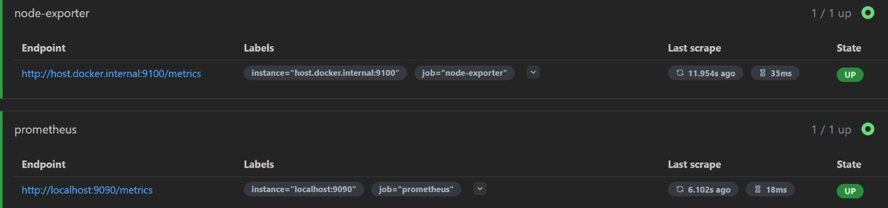
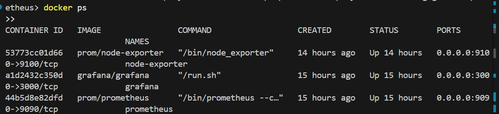

# 📊 Monitoring Infrastructure with Prometheus & Grafana

This project demonstrates how to set up a containerized monitoring stack using **Prometheus**, **Grafana**, and **Node Exporter** to monitor system-level metrics in real time using Docker.

---

## 📁 Project Structure


grafana-prometheus/
├── prometheus.yml # Prometheus configuration file
└── README.md # Project documentation


---

## 🐳 Docker-Based Monitoring Stack

> All containers are connected using a shared Docker network.

### 🔹 1. Create a Docker Network

```bash
docker network create monitoring-net

docker run -d --name prometheus \
  --network monitoring-net \
  -p 9090:9090 \
  -v ${PWD}/prometheus.yml:/etc/prometheus/prometheus.yml \
  prom/prometheus

docker run -d --name grafana \
  --network monitoring-net \
  -p 3000:3000 \
  grafana/grafana

docker run -d --name node-exporter \
  --network monitoring-net \
  -p 9100:9100 \
  prom/node-exporter

## 📸 Screenshots

### ✅ Prometheus Targets Page
> Showing successful scraping of Node Exporter  


### ✅ Grafana Node Exporter Dashboard
> Pre-built Dashboard ID 1860 with system metrics  


### ✅ Docker Containers Running
> All 3 containers: Prometheus, Grafana, Node Exporter  


### ✅ (Optional) CloudWatch Metrics Preview
> If you're using AWS monitoring in future  

